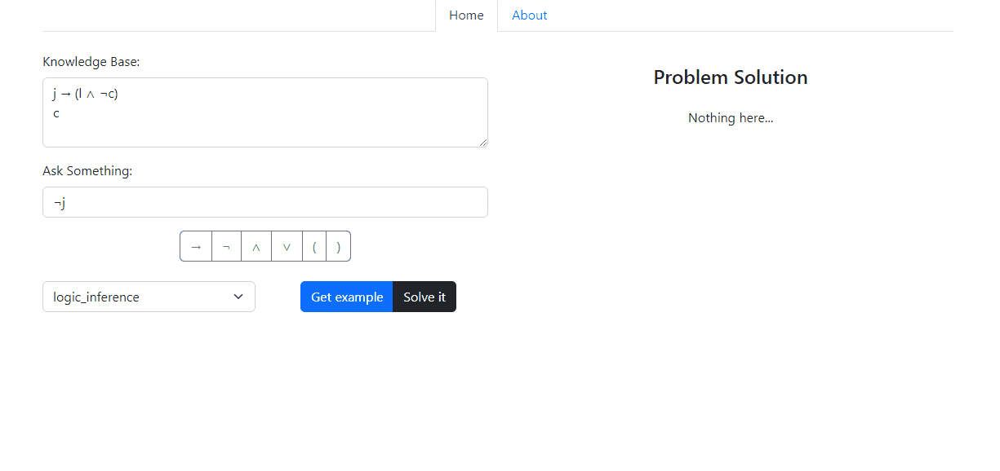
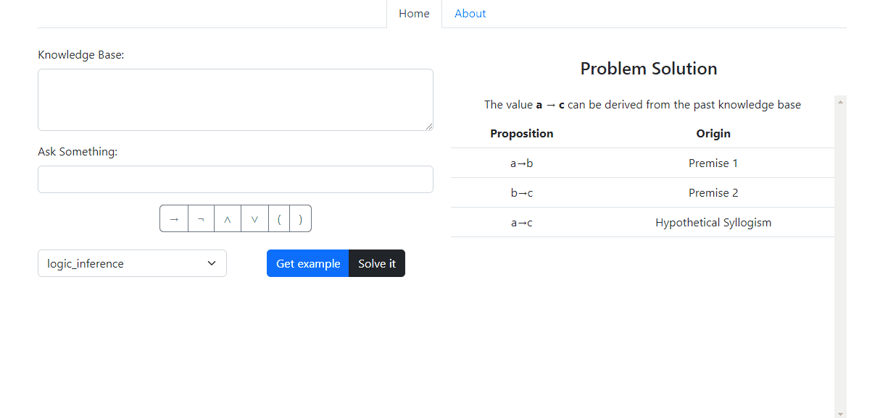
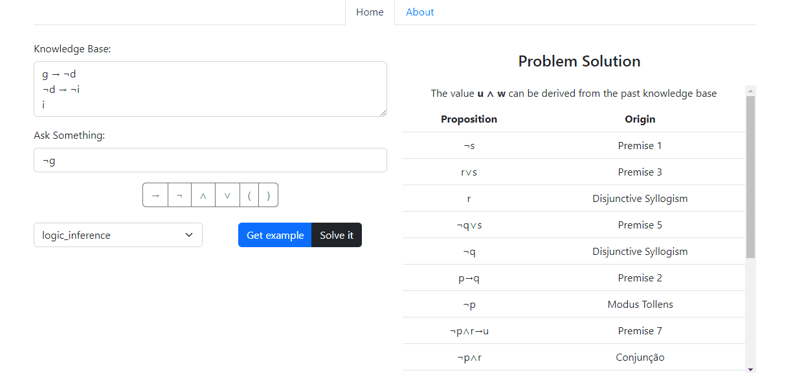

## Flask WebApp to solve logic problems

[Logic Solver](https://logic-solver-com.onrender.com/) is a web app that can solve logic problems with different 
methods

# Solving problems easily

## A simple and clean GUI

You can get examples and see its solutions.

## Write yours sentences

A virtual mini keyboard helps you to write the logic sentences.

## Use different methods

There are 3 different methods to solve your logic problems.

# TO DO

**About Inference Method:**

- [X] Add other inference rules (~~hypotetic syllogism~~, ~~resolution~~)
- [X] Do inference rules functions not depended of arguments positions
- [X] On the Heuristic BFS, do the ~~conjection~~, ~~addition~~ and simplification rules checks
- [ ] Returns -1 for Modus Tollens
- [ ] Improve the parentesis code interpretation 